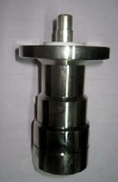
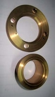
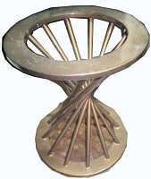
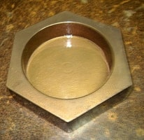
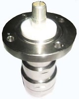

  
   
                    
  B. S. Brothers has the ability to handle a wide range of materials. We provide precision Metal Stampings for a variety of industries and applications -- from micro-miniature parts made with very thin material, to the strongest steel components required by the automotive Industry. 

We specialize in quick turnaround Precision Metal Stamping of heat-resistant metal alloys, ferrous, nonferrous, and countless exotic metals. We also offer value-added assembly for small volume and prototype orders. 
